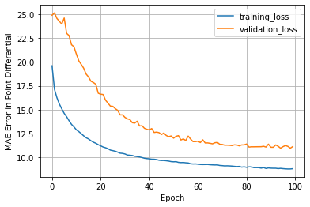
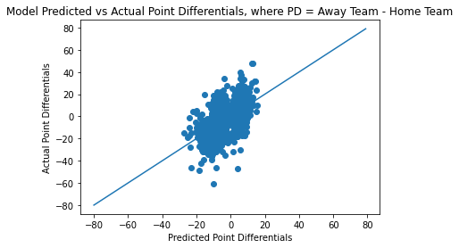
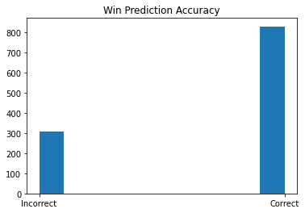

<br />
<p align="center">
  <a href="https://nba.com">
    
  </a>


  <h3 align="center">NBA Predictor & Webscraper</h3>
</p>


<!-- TABLE OF CONTENTS -->
## Table of Contents

* [About the Project](#about-the-project)
* [Getting Started](#getting-started)
* [Usage](#usage)
* [Neural Network Performance](#Neural-Network-Performance)
* [Contact](#contact)
* [Acknowledgements](#acknowledgements)


<!-- ABOUT THE PROJECT -->
## About The Project

According to _The Success Equation_ (Michael Mauboussin), compared to Football (American and actual), Hockey, and Baseball, Basketball is the most 'skill-based' sport.

Outcomes and victories in Basketball are more representative of the difference between the skills and talents of the winners and the losers. This project
seeks to accurately predict NBA championships using a regression Neural Net. It also includes a webscraper .py file, which can be used to change the training & test datasets. 

The model uses Mean Absolute Error as its loss function. This is because the distribution of the target variable (point differential = home team score - away team score) is gaussian, but 
may include significant outliers (from 20pt+ blowouts etc). MAE is more robust to outliers.


***TODO:***
* Create other predictors - PCA regression?

<!-- GETTING STARTED -->
## Getting Started

Some Python Libraries need to be installed (BeautifulSoup and Selenium for the Webscraper, Tensorflow etc. for the Neural Network). These are listed as the imports in the python files.

Aside from these libraries, ChromeDriver (WebDriver for Chrome) must be installed. The executable (chromedriver.exe) should be placed in the nbapredictor file directory.

Clone the repo
```sh
git clone https://github.com/carlchua/nbapredictor.git
```


<!-- USAGE EXAMPLES -->
## Usage
### Webscraper

```sh
py webscraper.py rsg 2016 2019
```
The above code will return regular season game data from 2016 to 2019. winner.txt records the N, T1, T2, where N is the winning team (1 or 2 - this is redundant), and T1 and T2 are the scores for teams 1 and 2. 
Currently, there is no functionality for players whose names have special characters not contained in ASCII.

```sh
py webscraper.py szn 2018
```
The above code will return player data for the 2018 season.

```sh
py webscraper.py train 2015 2019
```
The above code returns the necessary data to train the neural network model. This encompasses monthly advanced team stats from the 2015-2019 regular seasons. The data is also cleaned and organized properly for the neural network.
This command will not work for years before 2012, since NBA.com did not track advanced stats before then. Implementing a webscraper that uses basketball-reference for stats instead is a future possibility (this will be more challenging
since the html/table arrangement is more complicated there).

### Neural Network

The Neural Network code is available in both Jupyter Notebook (.ipynb) format, and regular Python file (.py) format. 

<!-- Neural Network Performance -->
## Neural Network Performance

<p align="center">
    
</p>

<p align="center">
    
</p>

<p align="center">
    
</p>

The model was 0.7297535211267606% accurate (based on the testing data).
<!-- CONTACT -->
## Contact

Carl Chua - carlchua@berkeley.edu

Project Link: [https://github.com/carlchua/nbapredictor](https://github.com/carlchua/nbapredictor)


